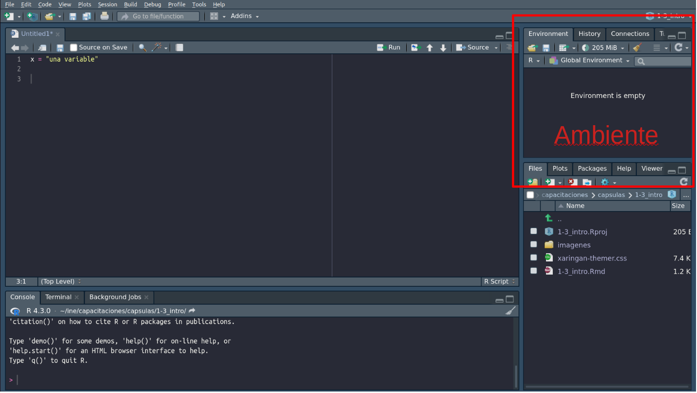

class: center, middle

.linea-superior[]
.linea-inferior[]


## INE Educa: Clases abiertas de R

## Introducción a RStudio

## Proyecto Ciencia de Datos


```{r setup, include=FALSE}
options(htmltools.dir.version = TRUE)
knitr::opts_chunk$set(message = FALSE, warning = F, eval = T, fig.align = "center") 
options(scipen = "999")
```

```{r xaringan-themer, include=FALSE, warning=FALSE}
library(xaringanthemer)
xaringanExtra::use_panelset()
```


---


background-image: url("imagenes/fondo2.PNG")
background-size: contain;
background-position: 100% 0%

# Conociendo RStudio

RStudio es un entorno de desarrollo (IDE en inglés) pensado especialmente para R

--

Es el IDE más popular dentro de la comunidad de R


--

Tiene una gran cantidad de funcionalidades que ayudan en el trabajo cotidiano


---
background-image: url("imagenes/fondo2.PNG")
background-size: contain;
background-position: 100% 0%

# Panel de scripts

.center[


]

---

background-image: url("imagenes/fondo2.PNG")
background-size: contain;
background-position: 100% 0%

# Panel de ambiente

.center[


]

---

background-image: url("imagenes/fondo2.PNG")
background-size: contain;
background-position: 100% 0%

# Panel de archivos

.center[


]


---
background-image: url("imagenes/fondo2.PNG")
background-size: contain;
background-position: 100% 0%

# Panel de consola

.center[


]


---

class: center, middle

.linea-superior[]
.linea-inferior[]


## INE Educa: Clases abiertas de R

## Introducción a RStudio

## Proyecto Ciencia de Datos
